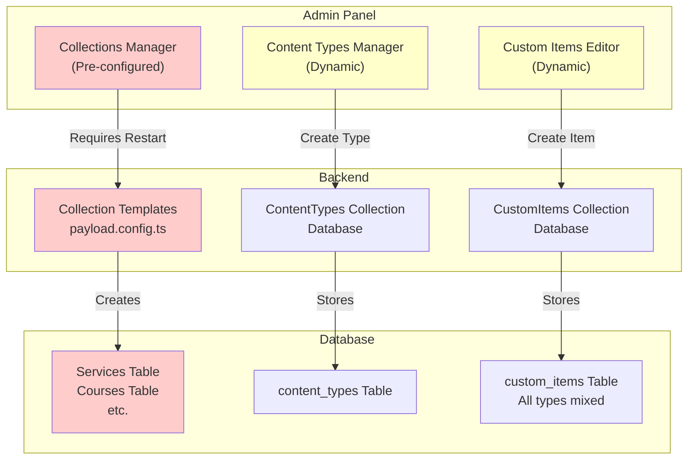
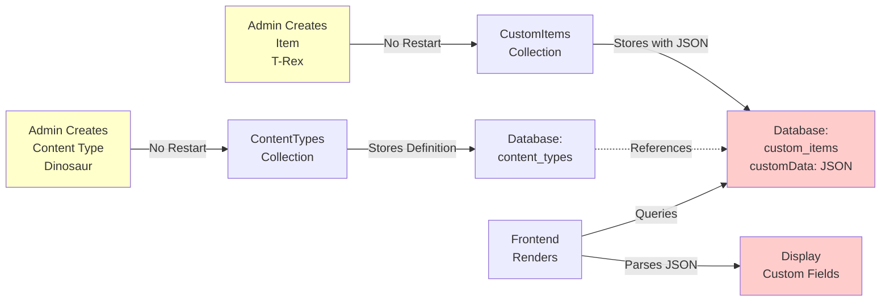
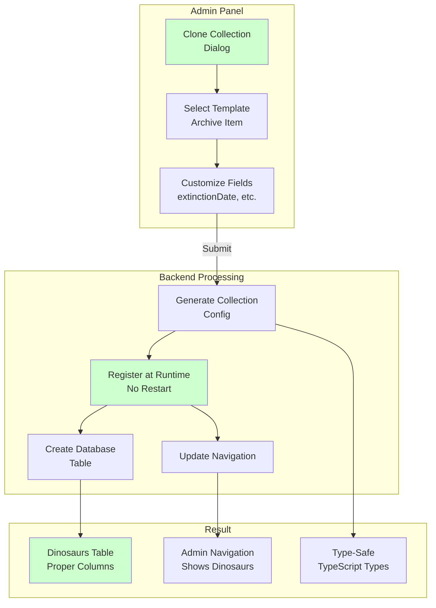
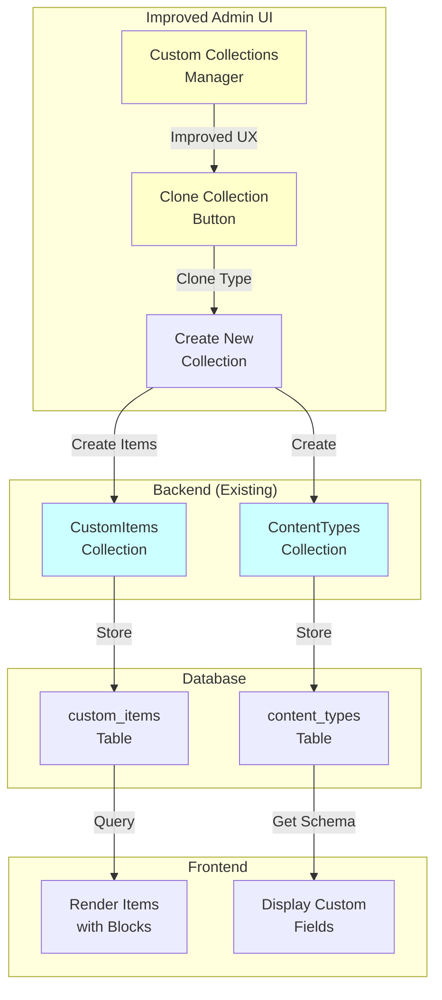
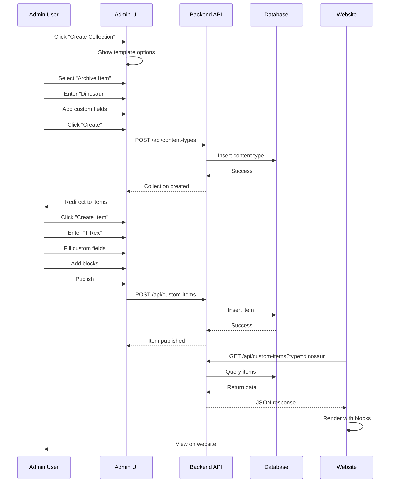
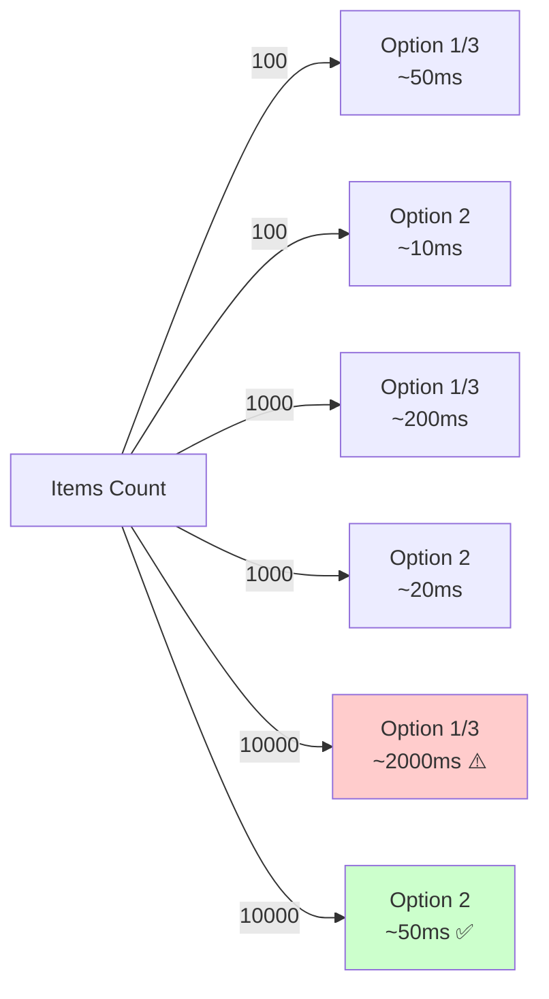
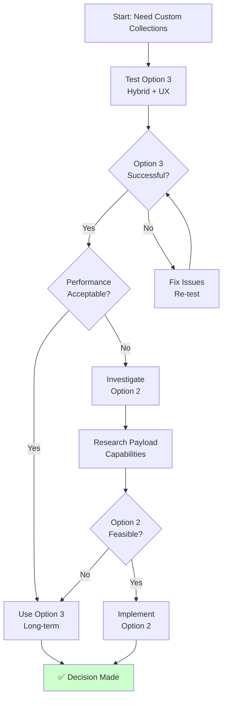

# Dynamic Collections Architecture Diagrams

## Current State: Two Disconnected Systems



---

## Option 1: Status Quo (Custom Items Only)



**Pros:** No restart, fully dynamic  
**Cons:** Single table, JSON storage, poor performance at scale

---

## Option 2: Dynamic Collections (Preferred)



**Pros:** Best performance, clean navigation, type-safe  
**Cons:** Complex implementation, requires investigation

---

## Option 3: Hybrid + Improved UX (Test First)



**Pros:** Quick to implement, validates workflow, no restart  
**Cons:** Single table limitation, performance ceiling

---

## Data Flow: Creating a Dinosaur Collection (Option 3)



---

## Database Schema Comparison

### Option 1 & 3: Custom Items (Single Table)
```
custom_items
├── id (PK)
├── title
├── slug
├── content (rich text)
├── blocks (JSON)
├── contentType (FK → content_types)
├── customData (JSON) ← All custom fields here
├── featuredImage (FK → media)
├── gallery (JSON array)
├── categories (array)
├── tags (array)
├── status (published/draft)
└── createdAt, updatedAt
```

**Problem:** All custom fields in JSON = slower queries, no validation

---

### Option 2: Dynamic Collections (Multiple Tables)
```
dinosaurs
├── id (PK)
├── title
├── slug
├── content (rich text)
├── blocks (JSON)
├── extinctionDate ← Proper column
├── discoveryLocation ← Proper column
├── fossilType ← Proper column
├── featuredImage (FK → media)
├── gallery (JSON array)
├── categories (array)
├── tags (array)
├── status (published/draft)
└── createdAt, updatedAt

classic_cars
├── id (PK)
├── title
├── slug
├── content (rich text)
├── blocks (JSON)
├── manufacturer ← Proper column
├── yearProduced ← Proper column
├── engineType ← Proper column
├── ... (same media/status fields)
```

**Benefit:** Proper columns = faster queries, validation, type safety

---

## Performance Comparison



---

## Implementation Timeline

```mermaid
gantt
    title Dynamic Collections Implementation Timeline
    
    section Option 3 Testing
    Seed Data :opt3a, 0, 3d
    UI Improvements :opt3b, 3d, 3d
    Blocks Support :opt3c, 6d, 2d
    Testing & Feedback :opt3d, 8d, 3d
    
    section Option 2 Investigation
    Research Payload :opt2a, 11d, 5d
    Prototype :opt2b, 16d, 7d
    Implementation :opt2c, 23d, 14d
    
    section Decision
    Evaluate Results :decision, 37d, 2d
    Final Decision :final, 39d, 1d
```

---

## Decision Tree



