# Dynamic Collections Architecture Decision Document

**Date:** 2026-01-21  
**Status:** DECISION PENDING - Testing Phase Required  
**Owner:** David Bryan  
**Next Review:** After testing phase completion

---

## Executive Summary

This document outlines the architectural decision for enabling website admins to create custom content collections (like "Dinosaurs", "Classic Cars", etc.) without developer intervention or server restarts. The current system has two separate, disconnected approaches, and we need to consolidate them into a seamless user experience.

**Current Status:** Two viable options identified. User preference is **Option 2 (Dynamic Collection Registration)**, but recommends testing **Option 3 (Hybrid + Improved UX)** first to validate the approach before committing to Option 2.

---

## The Problem

Website admins want to:
1. Create a new collection type (e.g., "Dinosaur") from the CMS admin panel
2. Define custom fields (extinctionDate, discoveryLocation, fossilType)
3. Start creating items immediately
4. **Without leaving the CMS or restarting the server**

Currently, this is **impossible** without developer intervention.

---

## Current Architecture

### System 1: Collection Templates (Pre-configured)
- **Location:** `apps/cms/src/collection-templates/`
- **How it works:** Predefined templates (Services, Courses, Testimonials, etc.)
- **Limitation:** ❌ Requires server restart to add new collections
- **Scope:** Fixed set of types defined in code

### System 2: Content Types + Custom Items (Dynamic)
- **Location:** `apps/cms/src/collections/ContentTypes.ts` + `CustomItems.ts`
- **How it works:** Admin creates a "Content Type" definition, then creates items in Custom Items
- **Advantage:** ✅ Works WITHOUT server restart
- **Limitation:** All items stored in ONE table with JSON custom fields
- **Scope:** Unlimited custom types, fully dynamic

---

## The Debate: Three Options

### Option 1: Status Quo - Use Custom Items System
**Recommendation:** ❌ Not recommended (but functional)

**Pros:**
- Already fully implemented
- No server restart needed
- Unlimited custom types
- Works entirely in admin UI

**Cons:**
- Poor UX - confusing "Content Types" terminology
- All types share one database table (performance concerns at scale)
- Not intuitive for WordPress-familiar admins
- Custom fields stored as JSON (less efficient queries)

**When to use:** Quick MVP, small number of types, non-technical users

---

### Option 2: Dynamic Collection Registration (Preferred Long-term)
**Recommendation:** ✅ User's preference - requires investigation

**Pros:**
- Each collection gets its own database table (best performance)
- Clean navigation - each type visible in admin
- Type-specific validation and permissions
- Proper TypeScript types generated
- Scales to enterprise use cases
- Most flexible and powerful

**Cons:**
- Requires generating collection configs at runtime
- Complex implementation - needs Payload plugin system or file generation
- Database schema changes need to be handled dynamically
- Requires investigation into Payload CMS v3 capabilities

**Implementation approach:**
1. Generate collection TypeScript files dynamically
2. Register collections at runtime via Payload's plugin system
3. Auto-migrate database schema
4. Update navigation automatically

**Estimated effort:** 40-60 hours (requires deep Payload investigation)

---

### Option 3: Hybrid Approach + Improved UX (Recommended for Testing)
**Recommendation:** ✅ Test this FIRST before committing to Option 2

**Pros:**
- Leverages existing, proven Custom Items system
- Dramatically improved UX through rebranding
- No server restart needed
- Can be implemented in 10-15 hours
- Validates user workflow before investing in Option 2
- Provides fallback if Option 2 proves too complex

**Cons:**
- Single table for all custom types (performance ceiling ~10k items)
- Not ideal for enterprise scale
- Requires UX/messaging work

**Implementation approach:**
1. Rename "Content Types" → "Custom Collections"
2. Add "Clone Collection" feature to Content Types UI
3. Improve seed data with blocks support
4. Create demo content showing real-world usage
5. Test with actual users

**Why test this first:**
- Validates that the workflow is what users actually want
- Provides working prototype to show stakeholders
- Identifies UX issues before investing in Option 2
- Can be completed in 1-2 weeks
- Gives time to investigate Option 2 properly

---

## Architecture Comparison Diagram

```mermaid
graph TB
    subgraph "Option 1: Custom Items (Current)"
        A1["Admin UI<br/>Content Types"] -->|Create Type| A2["ContentTypes Collection<br/>Database"]
        A2 -->|Define Fields| A3["CustomItems Collection<br/>Single Table<br/>All Types Mixed"]
        A3 -->|JSON Storage| A4["customData Field<br/>Unstructured"]
    end

    subgraph "Option 2: Dynamic Collections (Preferred)"
        B1["Admin UI<br/>Clone Collection"] -->|Generate Config| B2["Runtime Collection<br/>Registration"]
        B2 -->|Create Table| B3["Dinosaurs Table<br/>Dinosaurs Table<br/>Classic Cars Table<br/>etc."]
        B3 -->|Structured Fields| B4["Type-specific Columns<br/>extinctionDate<br/>discoveryLocation"]
    end

    subgraph "Option 3: Hybrid + UX (Test First)"
        C1["Admin UI<br/>Custom Collections<br/>Clone Feature"] -->|Improved UX| C2["ContentTypes Collection<br/>Database"]
        C2 -->|Define Fields| C3["CustomItems Collection<br/>Single Table<br/>Better Seed Data"]
        C3 -->|Blocks Support| C4["Rich Content<br/>+ Custom Fields"]
    end

    style A3 fill:#ffcccc
    style B3 fill:#ccffcc
    style C3 fill:#ffffcc
```

---

## User's Decision & Next Steps

### Immediate Action: Test Option 3 (Hybrid + Improved UX)

**Why:** Validate the workflow and UX before investing 40-60 hours in Option 2.

**What needs to be built:**

1. **Improved Seed Data for Custom Items**
   - Create realistic "Dinosaur" content type with:
     - extinctionDate (date field)
     - discoveryLocation (text field)
     - fossilType (select field)
   - Seed 5-10 dinosaur items with rich content blocks
   - Show how blocks work with custom fields

2. **Improved Seed Data for Content Types**
   - Show how to create a content type
   - Demonstrate custom field configuration
   - Show the relationship between Content Type and Custom Items

3. **Enhanced UI/UX**
   - Add "Clone Content Type" button
   - Improve naming/labels for clarity
   - Create demo dashboard showing both systems

4. **Documentation**
   - Step-by-step guide for admins
   - Screenshots of the workflow
   - Real-world examples

**Success Criteria:**
- Admin can create "Dinosaur" type in <2 minutes
- Admin can add 5 dinosaur items with custom fields
- Blocks render correctly with custom fields
- UX feels intuitive (WordPress-like)

**Timeline:** 1-2 weeks

---

## After Testing: Evaluate Option 2

Once Option 3 is tested and validated:

1. **Gather feedback** from test users
2. **Assess performance** with realistic data volumes
3. **Decide:** Is Option 3 sufficient, or proceed with Option 2?
4. **If Option 2:** Investigate Payload CMS v3 capabilities:
   - Runtime collection registration
   - Dynamic schema generation
   - Plugin system capabilities
   - Database migration handling

---

## Technical Investigation Required (Option 2)

Before committing to Option 2, next agent must investigate:

1. **Payload CMS v3 Runtime Capabilities**
   - Can collections be registered after server start?
   - Does Payload support dynamic collection registration?
   - What's the plugin system architecture?

2. **Database Schema Management**
   - How to auto-migrate when new collection created?
   - Can Payload handle dynamic table creation?
   - What about rollback/deletion?

3. **TypeScript Type Generation**
   - Can we generate types at runtime?
   - How to update payload-types.ts dynamically?
   - Impact on frontend type safety?

4. **File System Approach**
   - Generate collection files to disk?
   - Where to store generated files?
   - How to version/track them?

5. **Performance & Scalability**
   - What's the overhead of dynamic registration?
   - Can we handle 100+ custom collections?
   - Impact on startup time?

---

## Files to Review

- `headless-cms/apps/cms/src/collections/ContentTypes.ts` - Content type definitions
- `headless-cms/apps/cms/src/collections/CustomItems.ts` - Custom items storage
- `headless-cms/apps/cms/src/endpoints/collectionTemplates.ts` - Template system
- `headless-cms/apps/cms/src/components/ContentTypeManager.tsx` - Admin UI
- `headless-cms/apps/cms/src/payload.config.ts` - Main config

---

## Conclusion

**Immediate Path Forward:**
1. ✅ Build Option 3 (Hybrid + Improved UX) with excellent seed data
2. ✅ Test with real workflow
3. ✅ Gather feedback
4. 🔍 Then investigate Option 2 feasibility
5. 🎯 Make final decision based on testing results

**User Preference:** Option 2 (Dynamic Collections) is the long-term goal, but Option 3 testing is the smart first step.

**Next Agent:** Start with Option 3 implementation. See TESTING_PHASE.md for detailed requirements.

