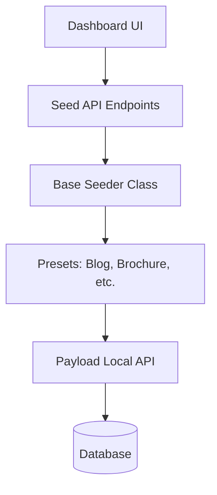

# Payload CMS Seeding System Guide

> [!NOTE]
> This is the canonical guide for the seeding system as of January 2026. it supercedes all previous audit and implementation documents in `docs/block-seed-data/`.

## Overview

The seeding system is designed to provide high-quality, block-based sample data for all collection types. It supports both **Core Collections** (Pages, Posts, etc.) and **Custom Collections** (Museum Items, Services, etc.) through a unified, preset-driven architecture.

## Architecture

The system is split into three main layers:

1.  **Core Seeder (`apps/cms/src/seed/base.ts`)**: Contains universal logic for creating blocks, images, and managing collection counts. It provides standard methods for seeding common patterns.
2.  **Presets (`apps/cms/src/seed/presets/`)**: Modular configuration files that define *what* data should be seeded for a specific site type.
3.  **API Endpoints (`apps/cms/src/endpoints/seed.ts`)**: REST API handlers that allow the UI to trigger seeding and clearing operations asynchronously.

### Logic Flow

---

## Available Presets

Each preset targets a specific business use case and includes pre-configured blocks (Hero, Content, Archive, CTA, etc.).

| Preset | Purpose | Key Collections |
| :--- | :--- | :--- |
| **Core** | Minimal baseline | Pages (Home, About) |
| **Blog** | Content-heavy sites | Pages, Posts, Categories, Tags |
| **Brochure** | Service-based sites | Pages, Case Studies, Services |
| **Ecommerce** | Online shops | Pages, Products, Categories |
| **Archive** | Catalogued data | Museum Items, People, Places, Events |

---

## API Endpoints

The seeding system is exposed via the following endpoints:

### 1. Collection Seeding
`POST /api/seed/collection`
Registers or updates a standard collection (e.g., `posts`).
- **Body**: `{ "collectionSlug": "posts", "action": "seed" | "clear" | "reseed" }`

### 2. Custom Content Type Seeding
`POST /api/seed/content-type`
Handles seeding for dynamically registered collections using templates.
- **Body**: `{ "templateId": "blog-post", "contentTypeId": "123", "action": "seed" | "clear" }`

> [!IMPORTANT]
> **Template Mapping**: The system automatically maps legacy or variant template names. For example, a custom collection using the `article` template is automatically mapped to the `blog-post` seeder logic to ensure data consistency.

---

## UI / UX Features

The **Collection Manager** (`/admin/collection-manager`) provides a real-time interface for managing seeds.

-   **Loading Overlays**: Visual spinners and progress indicators appear over collection cards during seed/clear operations to prevent conflicting actions.
-   **Synchronized Feedback**: Buttons update to "Seeding..." or "Clearing..." across both the collection card and the individual item list.
-   **Automatic Count Updates**: The dashboard accurately reflects the number of items currently in the database, including complex cases like the "Showcase" page.
-   **Individual Item Seeding**: Users can choose to seed the entire collection or pick specific items from the expanded list.

---

## Developer Guide: Adding New Seed Data

To add new sample items:

1.  **Update the Template**: Add the item definition to the relevant template file in `src/collection-templates/templates/` (e.g., `archive-item.ts`).
2.  **Define Blocks**: In `apps/cms/src/seed/base.ts`, use the `createBlocks` or `createRichText` helpers to define the visual content.
3.  **Update the Preset**: Ensure the preset in `src/seed/presets/` includes the new data if it's meant to be default.

---

## Maintenance & Best Practices

-   **British English**: Always use British English spellings for content (e.g., "Specialise", "Visualisation").
-   **Cache Busting**: When updating seed logic, ensure any relevant caches are invalidated via the UI components.
-   **No Placeholders**: Never use placeholder images; use the `generate_image` tool or approved assets from the media library.
